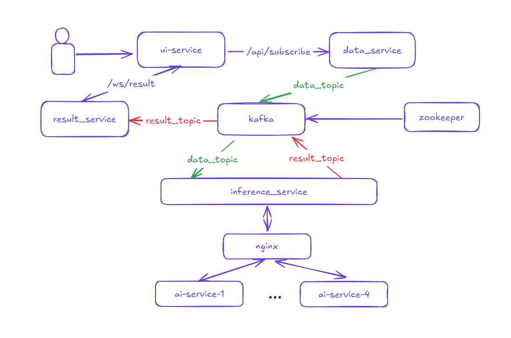
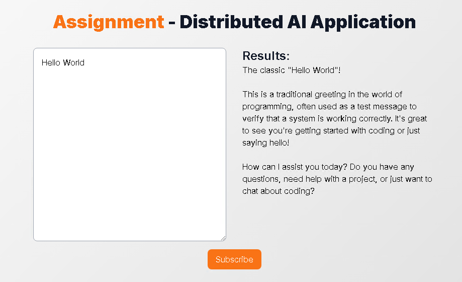

# Distributed AI Application with Microservices and Kafka

## Introduction
This project is a simple demonstration of a distributed AI application using a microservice architecture and Kafka messaging queue. It is developed using Next.js for the UI and a mix of Axum and Warp frameworks for the backend services.

## Architecture
This consists of five services:


1. **Inference Service**: Service responsible for distributing incoming text data for AI processing.
2. **Data Service**: Backend service to handle text subscription requests.
3. **AI Service**: Simulates AI inference processing by querying OpenRouter API and returns the result.
4. **Result Service**: Service that stores inferred results in a PostgreSQL database and broadcasts them via WebSocket.
5. **UI Service**: Provides a user interface for text subscription and displays the inferred data in real-time using WebSocket.

## Service Descriptions

### 1. Inference Service
- **Language**: Rust
- **Functionality**:
  - Subscribes to a Kafka topic (`data-topic`) to receive data for inference.
  - Forwards the text data to the `Nginx` for load balancing.
  - Nginx load balances the request and sends it to one of the AI service instances.
  - Publishes the inference result to another Kafka topic (`result-topic`).
  - Replicated into four instances.

### 2. Data Service
- **Language**: Rust (Axum framework)
- **Functionality**:
  - Exposes an API (`/api/subscribe`) to receive text data.
  - Publishes the received text to the Kafka topic (`data-topic`).
  - Sends success or failure response based on whether the text was successfully sent to Kafka.

### 3. AI Service
- **Language**: Python (FastAPI)
- **Functionality**:
  - Subscribes to the request from `Nginx`.
  - Simulates running an AI inference by querying the OpenRouter API with the received text data.
  - Returns the result to the inference service.
  - Replicated into four instances.

### 4. Result Service
- **Language**: Rust (Warp framework)
- **Functionality**:
  - Subscribes to the Kafka topic (`result-topic`) to receive inference results.
  - Saves the results (including id, content, and timestamp) to a PostgreSQL database.
  - Provides a WebSocket server to broadcast the data to clients when a new inference result is inserted.
  - Stores results in PostgreSQL, accessible on port 8080.

### 5. UI Service
- **Language**: Next.js
- **Functionality**:
  - Provides a user interface to subscribe text data.
  - Connects to WebSocket to receive and display inferenced results in real-time.
  - Accessible via `http://localhost`.

## Kafka Configuration
The system employs Kafka for messaging between services, and the configuration details are as follows:

- **Manual Offset Management**: To ensure at-least-once delivery and implement retry logic for error handling.
- **Topic Replication Factor**: Each topic is replicated twice for reliability.

## Deployment

### Prerequisites
- Docker
- Docker Compose

### Steps to Setup and Run the System
 ```sh
 docker-compose up --build
 ```
 This command will:
 - Start Zookeeper and Kafka.
 - Build and start the `data_service`, `inference_service`, `ai_service`, `result_service`, and `ui_service`.
 - Initialize PostgreSQL database.
 - Configure Nginx for load balancing.

## Testing

1. You can test on the UI (which is running on [http://localhost](http://localhost)).
2. Write the text in the left text area field and submit the subscribe button.
3. The inference progress will then be done, and the result of the inference is sent via WebSocket.
4. The result will be displayed in the right textarea field in real-time.

## Future Plans
- **Kubernetes**: Implement auto-scaling of each service.
- **Advanced Inference Models**: Integrate LLM-based models for inference.
- **User Management**: Implement user authentication and management using JWT tokens.
- **Monitoring and Logging**: Set up monitoring and logging using Grafana and Elasticsearch.
- **Kafka without Zookeeper**: Migrate to new version that doesn't need to use zookeeper.